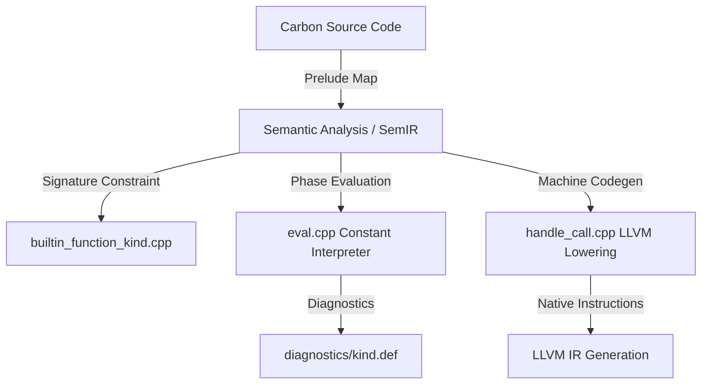

# Builtin Functions in the Carbon Toolchain

<!--
Part of the Carbon Language project, under the Apache License v2.0 with LLVM
Exceptions. See /LICENSE for license information.
SPDX-License-Identifier: Apache-2.0 WITH LLVM-exception
-->

Builtin functions are compiler-recognized primitives mapping directly from
Carbon code expressions (via standard prelude bindings) to optimized backend
execution. This document defines the complete structural workflow, C++ patterns,
constant evaluation logic, machine lowering mechanics, library bindings, and
validation strategies required to implement builtin functions in the Carbon
compiler.

---

## Technical Flow & Lifecycle



Adding a builtin function involves a 5-step integration:

1. **Define the Builtin Kind**: Register the enum in
   [builtin_function_kind.def](../../../toolchain/sem_ir/builtin_function_kind.def).
2. **Signature & Compile-Time Registry**: Declare the mapping name, parameter
   constraints, and compile-time evaluation residency in
   [builtin_function_kind.cpp](../../../toolchain/sem_ir/builtin_function_kind.cpp).
3. **Compile-Time Interpreter Support**: Wire constant evaluation hooks and
   bounds/exception diagnostics in
   [eval.cpp](../../../toolchain/check/eval.cpp).
4. **LLVM IR Lowering Support**: Connect target machine generation in
   [handle_call.cpp](../../../toolchain/lower/handle_call.cpp).
5. **Prelude Library Mapping**: Bind primitive interfaces to named builtins
   under [core/prelude/](../../../core/prelude/).

---

## Detailed Step-by-Step Implementation Guide

### Step 1: Kind Definition & Registration

Register your builtin function name using the X-macro in
[builtin_function_kind.def](../../../toolchain/sem_ir/builtin_function_kind.def):

```cpp
// toolchain/sem_ir/builtin_function_kind.def

// Converts an integer type to a floating-point type.
CARBON_SEM_IR_BUILTIN_FUNCTION_KIND(IntConvertFloat)
```

### Step 2: Signature Validation & Compile-Time Residence

Inside
[builtin_function_kind.cpp](../../../toolchain/sem_ir/builtin_function_kind.cpp):

1. **Define Parameter Constraints**: If the parameter requires novel constraints
   (e.g. "must be a float type"), define a template constraint struct checking
   the matching `SemIR` type instruction (such as `FloatType` or
   `FloatLiteralType`). Use pre-established semantic helpers:

    - `TypeParam<I, T>`: Ensures different parameters resolve to identical type
      structures (e.g., generic constraint matching).
    - `AnyInt`, `AnyFloat`, `AnySizedInt`, `AnySizedFloat`, `CharCompatible`,
      `StdInitializerList`, `NoReturn`.

2. **Map Literal Name & Register Constraint Signature**: Declare a `BuiltinInfo`
   constant inside `namespace BuiltinFunctionInfo` matching the macro-defined
   name:

    ```cpp
    // toolchain/sem_ir/builtin_function_kind.cpp

    constexpr BuiltinInfo IntConvertFloat = {
        "int.convert_float", ValidateSignature<auto(AnyInt)->AnyFloat>};
    ```

3. **Establish Compile-Time Residency Status**: Update
   `BuiltinFunctionKind::IsCompTimeOnly` to determine if a call requires
   compile-time evaluation:
    - **Checked/Diagnostics Primitives**: Return `true` immediately. Runtime
      lowering of these is illegal (e.g. `IntConvertFloatChecked`).
    - **Runtime Primitives**: Return
      `AnyLiteralTypes(sem_ir, arg_ids, return_type_id)` to enforce that
      expressions involving unsized literal values (like `IntLiteral` or
      `FloatLiteral`) are evaluated exclusively at compile-time (as they lack
      runtime representation).

---

### Step 3: Constant Evaluation Support

Wire the interpreter inside [eval.cpp](../../../toolchain/check/eval.cpp) to
execute compile-time computations:

1. **Implement Constant Evaluation Logic**:

    - Handle the builtin case inside `MakeConstantForBuiltinCall` (which
      processes the compile-time execution of the call).
    - Confirm type validation phase is `Phase::Concrete` to reject incomplete
      bindings:
        ```cpp
        case SemIR::BuiltinFunctionKind::IntConvertFloat: {
          if (phase != Phase::Concrete) {
            return MakeConstantResult(context, call, phase);
          }
          return PerformIntToFloatConvert(context, loc_id, arg_ids[0], call.type_id,
                                          /*require_exact=*/false);
        }
        ```
    - Extract inputs safely from local value stores (e.g.
      `context.ints().Get(arg.int_id)` or `context.floats().Get(arg.float_id)`).
    - Leverage high-precision LLVM mathematical structures (`llvm::APInt`,
      `llvm::APFloat`, `llvm::APSInt`) to handle custom bits and signedness
      safely.

2. **Diagnose Invalid Parameters or Exceptions**:

    - Define compile-time diagnostics inside
      [kind.def](../../../toolchain/diagnostics/kind.def):
        ```cpp
        // toolchain/diagnostics/kind.def
        CARBON_DIAGNOSTIC_KIND(IntTooLargeForFloatType)
        ```
    - Emplace localized diagnostic formatting messages where they are caught in
      `eval.cpp`:
        ```cpp
        CARBON_DIAGNOSTIC(IntTooLargeForFloatType, Error,
                          "integer value {0} too large for floating-point type {1}",
                          llvm::APSInt, SemIR::TypeId);
        context.emitter().Emit(loc_id, IntTooLargeForFloatType, val, dest_type_id);
        ```
    - Return `SemIR::ErrorInst::ConstantId` to gracefully abort invalid constant
      generation rather than crashing the compiler.

3. **Fast-Path Range Limits**:
    - Before evaluating expensive math operations on giant exponents (e.g.
      `1.0e1000000`), executing range limits check against `dest_width + 64`
      (sized) or `IntStore::MaxIntWidth` (unsized) is mandatory to prevent
      out-of-bounds calculations and compile-time memory exhaustion.

---

### Step 4: Machine Code Generation (LLVM Lowering)

Inside [handle_call.cpp](../../../toolchain/lower/handle_call.cpp):

1. **Map to Native LLVM Instructions**: For runtime-eligible builtins, map the
   call inside `HandleBuiltinCall` to native LLVM IR builder methods:

    ```cpp
    case SemIR::BuiltinFunctionKind::IntConvertFloat: {
      auto* operand = context.GetValue(arg_ids[0]);
      auto* dest_type = context.GetTypeOfInst(inst_id);
      bool is_signed = IsSignedInt(context, arg_ids[0]);
      context.SetLocal(
          inst_id, is_signed
                       ? context.builder().CreateSIToFP(operand, dest_type)
                       : context.builder().CreateUIToFP(operand, dest_type));
      return;
    }
    ```

2. **Assert on Compile-Time-Only Builtins**: Throw a hard assertion on
   lowering-cases for checked validator builtins that should never hit code
   generation:
    ```cpp
    case SemIR::BuiltinFunctionKind::IntConvertFloatChecked: {
      CARBON_CHECK(builtin_kind.IsCompTimeOnly(
          context.sem_ir(), arg_ids,
          context.sem_ir().insts().Get(inst_id).type_id()));
      CARBON_FATAL("Missing constant value for call to comptime-only function");
    }
    ```

---

### Step 5: Standard Library Prelude Integration

Map the standard library primitive interfaces to your newly minted named
builtins under [core/prelude/](../../../core/prelude/):

-   **Primitive Mappings**: Bind Carbon methods directly to string-literal
    builtin equivalents:
    ```carbon
    fn Convert[self: Self]() -> Float(To) = "int.convert_float";
    ```
-   **Strict Orphan Rule Compliance**: Carbon's orphan rules prohibit
    implementing interfaces where neither the type nor the interface is locally
    defined in the backing source module.
    -   **Literal Conversions**: Literal types (like `FloatLiteral`,
        `IntLiteral`) do not have backing Carbon source files. Therefore, an
        `impl` of `UnsafeAs` (which is defined in `as.carbon`) between two
        literal types must reside inside `as.carbon` itself.
    -   **Sized Conversions**: Implementations targeting sized primitives (e.g.
        `Int(N)`, `Float(N)`) must reside in their respective type source files
        (such as [int.carbon](../../../core/prelude/types/int.carbon) or
        [float.carbon](../../../core/prelude/types/float.carbon)) where the
        backing target type resides to prevent duplicate symbols and structural
        recursion loops.

---

## High-Fidelity Validation & Test Authoring

Follow the [Toolchain tests](../toolchain_tests/SKILL.md) skill with specialized
patterns for builtins:

### 1. Checker Builtin File Splits

Create validation splits under
[toolchain/check/testdata/builtins/](../../../toolchain/check/testdata/builtins/):

-   **Test Naming Convention**: All tests under
    [toolchain/check/testdata/builtins/](../../../toolchain/check/testdata/builtins/)
    must be named after the builtin they are testing, replacing `.` characters
    in the builtin name with `/` (directories). For example, a test for the
    builtin `"char_literal.convert"` must be located at
    `toolchain/check/testdata/builtins/char_literal/convert.carbon`.
-   **Minimal Prelude & Direct Call Isolation**: Builtin tests must **not** test
    the prelude library or operators. They must use the minimal primitive
    prelude
    (`// INCLUDE-FILE: toolchain/testing/testdata/min_prelude/primitives.carbon`)
    or a smaller prelude, and explicitly declare and call the builtin functions
    under test directly (e.g., `fn Add(a: f64, b: f64) -> f64 = "float.add";`).
    This isolates the testing of compiler builtins from the library prelude.
-   **Min-Prelude Limitations**: Standard operators (like `+`, `-`, `/`, `<`,
    etc.) are **not** available in minimized preludes because the core operators
    library isn't imported. To write tests with a minimal footprint, call
    primitive builtins directly (e.g. `float.negate`, `float.div`) inside your
    test code to build expressions.
-   **Canonicalized Float Comparison**: In SemIR, real literal representations
    with identical mathematical values can result in mismatched `RealId` objects
    based on spelling variations. Verify compile-time constant conversions using
    canonicalized comparison functions (e.g. passing converted results through
    `Expect(X as f64)`) to completely avoid spelling mismatches in expected
    outputs.
-   **Locals Bypass**: If validating generic implicit conversions, compile-time
    arguments cannot take local runtime variable parameters. Validate
    compile-time conversions by passing literal constants directly, and sized
    variable implicit conversions at runtime.

### 2. Machine Codegen Lowering Splits

Create testing splits under
[toolchain/lower/testdata/builtins/](../../../toolchain/lower/testdata/builtins/):

-   Emplace a simple carbon binding to the tested builtin.
-   Confirm matching LLVM metadata target definitions are mapped precisely
    (e.g., matching `sitofp i32 %a to float`, `fptosi float %a to i32`).
