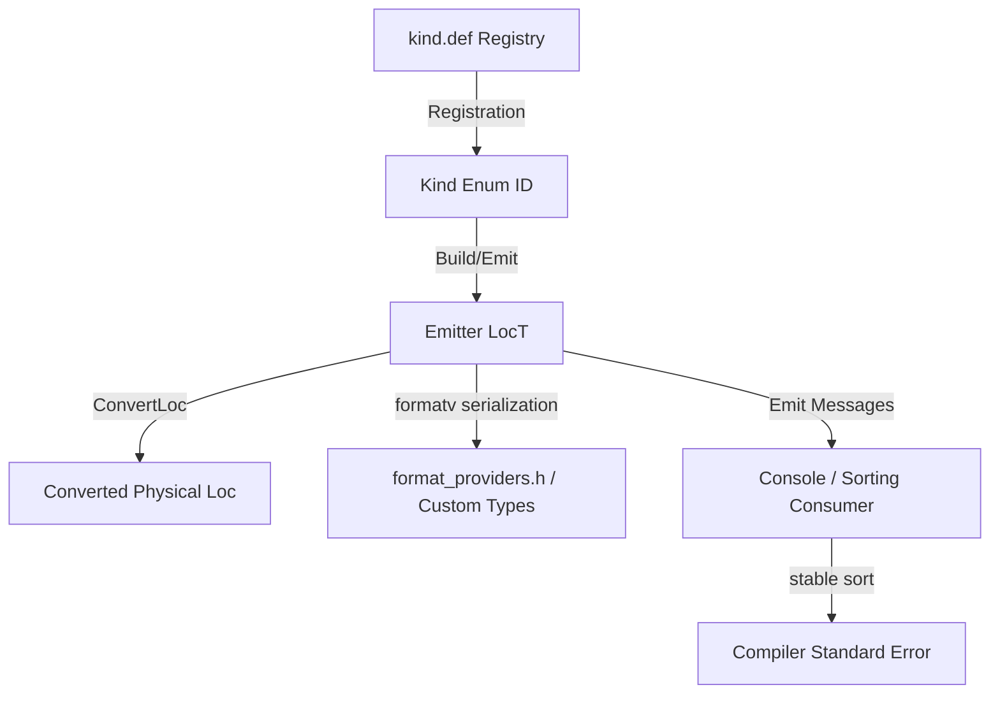

# Diagnostics in the Carbon Toolchain

<!--
Part of the Carbon Language project, under the Apache License v2.0 with LLVM
Exceptions. See /LICENSE for license information.
SPDX-License-Identifier: Apache-2.0 WITH LLVM-exception
-->

The Carbon compiler features a highly-engineered, context-aware diagnostics
framework designed to deliver precise, readable, and highly targetable
diagnostic output (errors, warnings, notes). This document establishes strict
rules for declaring, formatting, emitting, testing, and styling compiler
diagnostics.

---

## Architecture Overview



Diagnostics are handled via three decoupled core components:

1.  **Registry**: Globally enumerated kinds inside
    [kind.def](../../../toolchain/diagnostics/kind.def).
2.  **Emitters**: Specialized formatting pipelines (parameterized on custom
    phase location types `LocT` like `Token` or `LocId`) that convert raw tokens
    to standardized physical source locations (file, line, column, and text
    snippet).
3.  **Consumers**: Pipelines that process, track, filter, and sort diagnostics.
    The default `SortingConsumer` buffers and stable-sorts diagnostics based on
    their `last_byte_offset` matching compiler traversal order to ensure perfect
    causal ordering.

---

## 1. Declaring and Registering Diagnostics

All diagnostic types must pass structural uniqueness and coverage verifications.

### The Diagnostic Registry

Every diagnostic kind must be registered globally as an enum option under
[kind.def](../../../toolchain/diagnostics/kind.def):

```cpp
// toolchain/diagnostics/kind.def
CARBON_DIAGNOSTIC_KIND(RealLiteralTooLargeForUnsizedInt)
```

### The Uniqueness Rule

To ensure optimal compile-time and analysis integrity, every diagnostic kind
declared in `kind.def` **MUST** be mapped to **one and only one** C++ macro
declaration (`CARBON_DIAGNOSTIC` or `CARBON_DIAGNOSTIC_ON_SCOPE`).

-   **DO NOT** duplicate diagnostic definitions across different locations.
-   The C++ representation of the diagnostic is a static/global constant of type
    `DiagnosticBase<Args...>`.
-   **Local Scope (Recommended)**: If the diagnostic is unique to a single
    block/function body, declare it **locally** inside the function body
    adjacent to its `Emit` trigger:
    ```cpp
    void ConvertFloatValueToInt(...) {
      CARBON_DIAGNOSTIC(FloatNaNConvertedToInt, Error,
                        "cannot convert NaN to integer type {0}", SemIR::TypeId);
      context.emitter().Emit(loc_id, FloatNaNConvertedToInt, dest_type_id);
    }
    ```
-   **File Scope**: If the diagnostic is shared among multiple functions inside
    the _same_ file, declare it at **file scope** inside the anonymous namespace
    of the `.cpp` file.
-   **Global Scope**: If a diagnostic (such as a shared helper note) is reused
    _across different physical files_, define it in a shared header (e.g.
    context/check helpers) and mark it `extern` where applicable, ensuring the
    macro is only invoked once.

---

## 2. Formatting Diagnostic Arguments

Carbon diagnostics leverage LLVM's `formatv` engine. Parameters must be passed
using strongly-typed arguments to preserve translation capability.

### String Lifetimes & Pitfalls

-   **`llvm::StringRef` is DISALLOWED**: Do not pass `StringRef` as a parameter
    type to `CARBON_DIAGNOSTIC` due to unsafe lifetime and buffer-allocation
    boundaries.
-   **`llvm::StringLiteral` is DISALLOWED**: Do not use literal types as
    arguments as they prevent future diagnostic localization and translations.
-   **Use `std::string`**: If string formatting or custom allocations are
    required, declare the parameter storage type as `std::string`.

### Format Selectors (`format_providers.h`)

Use specialized formatting wrappers under
[format_providers.h](../../../toolchain/diagnostics/format_providers.h) to
express clean inline options in format strings:

| Wrapper                    | Target Format Style             | Example Usage                  | Output                                                              |
| :------------------------- | :------------------------------ | :----------------------------- | :------------------------------------------------------------------ |
| **`BoolAsSelect`**         | `{Index:true\|false}`           | `"{0:is signed\|is unsigned}"` | Maps bool to selection string.                                      |
| **`IntAsSelect`**          | `{Index:=Val:String\|:Default}` | `"{0:=1:is\|:are}"`            | Matches exact options.                                              |
| **`IntAsSelect` (Plural)** | `{Index:s}`                     | `"{0} argument{0:s}"`          | Prints `"s"` if value != 1 (e.g., `"1 argument"`, `"3 arguments"`). |

### Custom Toolchain Type Mappings

Custom structures can define how they serialize inside diagnostics using the
`DiagnosticType` tag mapping to `Diagnostics::TypeInfo<StorageType>`:

-   **Identifiers & Names** (declared in `check/diagnostic_helpers.h`):
    -   `NameId`: Formats raw identifier spelling, safely escaping keyword
        conflicts under backticks automatically.
    -   `LibraryNameId`: Formats custom library descriptors cleanly (e.g.
        `default library` or `library "foo"`).
-   **Sized Primitives**:
    -   `TypedInt`: Formats an `APInt` constant exactly, extracting target
        signedness representation automatically from its bound type
        representation.
-   **Type Formatter Hierarchy**: When choosing parameter types to print
    compiler type representations, follow this priority list:
    1.  **`TypeOfInstId` (Preferred)**: Resolves the backing type of an
        `InstId`, preserving programmatic aliasing, constraints, and source
        spelling context. Enclosed under backticks automatically.
    2.  **`InstIdAsType`**: Converts an `InstId` for a type expression, printing
        custom type layouts under backticks.
    3.  **`TypeId` (Fallback)**: Canonical description of the type. **Avoid when
        possible** because type canonicalization loses intermediate source
        program spelling and aliasing metadata.
    4.  **`*AsRawType` (e.g. `InstIdAsRawType`, `TypeIdAsRawType`)**: Formats
        the type layout exactly like their counter-structures above, but
        **omits** enclosing backticks (useful when inserting types inside larger
        code snippets).

---

## 3. Fluent Emission Builders & RAII Scopes

### Fluent Builder Pattern

For compound diagnostics requiring multiple sub-notes, carets, or custom code
overrides, use `Build` to chain actions fluently:

```cpp
context.emitter()
    .Build(second_node, ModifierRepeated, context.token_kind(second_node))
    .Note(first_node, ModifierPrevious, context.token_kind(first_node))
    .OverrideSnippet("custom snippet...")
    .Emit();
```

> [!SAFETY] Emitter builders are marked `[[nodiscard]]`. To prevent a developer
> from creating a builder but failing to terminal-chain `.Emit()`, the builder
> uses an rvalue overload `Emit() &&` that triggers a compile-time
> `static_assert(false)`. You must save the builder to an lvalue or execute the
> chain exactly as `emitter.Build(...).Note(...).Emit()`.

### RAII Context & Annotation Scopes

Manage large checking structures requiring blanket note context using RAII block
scopes:

-   `ContextScope`: Automatically converts any diagnostics emitted within its
    scope into sub-notes under a high-level operation descriptor:
    ```cpp
    ContextScope context_scope(&context.emitter(), [&](ContextBuilder& builder) {
      builder.Context(eval_loc, InCallToEvalFn);
    });
    // any checker error emitted here will automatically append the 'InCallToEvalFn' note
    ```
-   `AnnotationScope`: RAII block scope that automatically attaches blanket note
    annotations to all scoped diagnostics.

---

## 4. Diagnostics Wording Style Guide

Refer to the official
[Diagnostic message style guide](../../../toolchain/docs/diagnostics.md#diagnostic-message-style-guide)
for complete details.

To maintain message consistency and integrate cleanly with Clang diagnostics in
interoperable code, adhere strictly to these rules:

-   **Start with lowercase and omit periods**: Start diagnostic messages with a
    lowercase letter or quoted code, and do **not** end them with a period
    (e.g., `"cannot convert..."` or ``"`self` declared..."``).
-   **Use backticks for quoted code**: Enclose identifiers, code constructs, and
    types inside standard backticks (e.g., ``"`{0}` is bad"``).
-   **Phrase as bullet points without articles**: Phrase diagnostics as
    descriptive bullet points or sentence fragments rather than full sentences.
    Leave out standard articles (`a`, `an`, `the`) unless necessary for logical
    clarity. Semicolons can be used to separate fragments within a message.
-   **Describe the situation and language rule**: Diagnostics should describe
    the exact situation the toolchain observed. The language rule violated can
    be mentioned if it wouldn't otherwise be clear:
    -   _Situation-only_: `"redeclaration of X"` (implies that redeclaration is
        not permitted).
    -   _Rule-inclusion_:
        ``"`self` declared in invalid context; can only be declared in implicit parameter list"``.
-   **Wording Choice ("cannot" vs "allowed")**: Explicitly avoid `"allowed"`,
    `"legal"`, `"permitted"`, `"valid"`, and related passive wording. You may
    use `"cannot"` if needed, but try to use phrasing that does not require it:
    -   _Correct_: ``"`export` in `impl` file"`` (Avoids `"allowed"`)
    -   _Incorrect_: ``"`export` is only allowed in API files"``
    -   _Correct_: ``"`extern library` specifies current library"`` (Avoids
        `"cannot"`)
    -   _Incorrect_: ``"`extern library` cannot specify the current library"``
-   **Developer Intent Hints**: It is acceptable for a diagnostic to guess at
    the developer's intent and provide a hint _after_ explaining the situation
    and the rule, but never as a substitute for that:
    -   _Correct_:
        ``"cannot implicitly convert `i32` to `String`; add `as String` for explicit conversion"``
    -   _Incorrect_: ``"add `as String` to convert `i32` to `String`"`` (Lacks
        the core violation message).
-   **Structure for Tooling API**: Try to structure diagnostics such that
    parameter inputs can be programmatically extracted without string parsing
    (prefer strongly-typed parameters over format placeholders where possible).

---

## 5. Diagnostics Testing & Coverage Verification

Carbon strictly enforces testing coverage at build-time.

1.  **Tag Verification Requirement**: Every diagnostic kind declared in
    `kind.def` (which is not blacklisted in the `UntestedKinds` array under
    [coverage_test.cpp](../../../toolchain/diagnostics/coverage_test.cpp))
    **MUST** be verified by at least one testcase file inside
    `toolchain/*/testdata/`.
2.  **Stderr Checklist Matchers**: The testcase split verifying the diagnostic
    must catch it using standard CHECK matchers, explicitly tracking the
    matching enum tag in standard error comments:
    ```carbon
    // CHECK:STDERR: fail_bounds.carbon:[[@LINE+1]]:15: error: cannot convert NaN to integer type `i32` [FloatNaNConvertedToInt]
    let a: i32 = Convert(nan_val);
    ```
3.  **Build Enforcement**: Failing to provide a diagnostic test check matcher
    triggers a build compilation error on the target test
    `//toolchain/diagnostics:coverage_test`.
