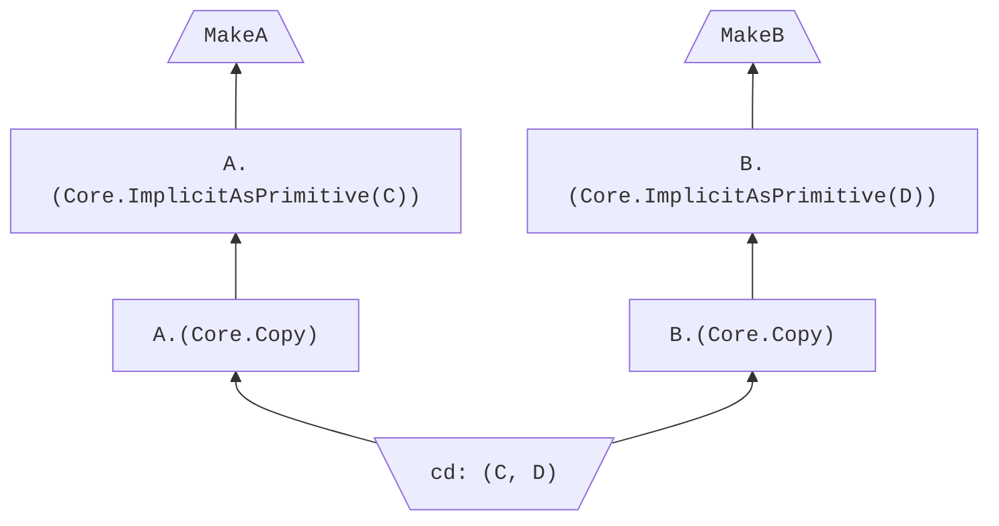

# Pattern matching

<!--
Part of the Carbon Language project, under the Apache License v2.0 with LLVM
Exceptions. See /LICENSE for license information.
SPDX-License-Identifier: Apache-2.0 WITH LLVM-exception
-->

<!-- toc -->

## Table of contents

-   [Overview](#overview)
-   [Pattern Syntax and Semantics](#pattern-syntax-and-semantics)
    -   [Expression patterns](#expression-patterns)
        -   [Alternatives considered](#alternatives-considered)
    -   [Binding patterns](#binding-patterns)
        -   [Name binding patterns](#name-binding-patterns)
        -   [Anonymous bindings](#anonymous-bindings)
            -   [Alternatives considered](#alternatives-considered-1)
        -   [`auto` and type deduction](#auto-and-type-deduction)
        -   [Alternatives considered](#alternatives-considered-2)
    -   [`var`](#var)
        -   [Alternatives considered](#alternatives-considered-3)
    -   [`unused`](#unused)
    -   [Tuple patterns](#tuple-patterns)
    -   [Struct patterns](#struct-patterns)
        -   [Alternatives considered](#alternatives-considered-4)
    -   [Alternative patterns](#alternative-patterns)
    -   [Templates](#templates)
    -   [Refutability, overlap, usefulness, and exhaustiveness](#refutability-overlap-usefulness-and-exhaustiveness)
        -   [Alternatives considered](#alternatives-considered-5)
-   [Pattern usage](#pattern-usage)
    -   [Pattern match control flow](#pattern-match-control-flow)
        -   [Alternatives considered](#alternatives-considered-6)
        -   [Guards](#guards)
    -   [Pattern matching in local variables](#pattern-matching-in-local-variables)
-   [Evaluation order](#evaluation-order)
    -   [Alternatives considered](#alternatives-considered-7)
-   [Open questions](#open-questions)
    -   [Slice or array nested value pattern matching](#slice-or-array-nested-value-pattern-matching)
    -   [Pattern matching as function overload resolution](#pattern-matching-as-function-overload-resolution)
-   [Alternatives considered](#alternatives-considered-8)
-   [References](#references)

<!-- tocstop -->

## Overview

A _pattern_ is an expression-like syntax that describes the structure of some
value. The pattern may contain unknowns, so it can potentially match multiple
values, and those unknowns may have names, in which case they are called
_binding patterns_. When a pattern is executed by giving it a value called the
_scrutinee_, it determines whether the scrutinee matches the pattern, and if so,
determines the values of the bindings.

A _full pattern_ is a complete input to a pattern matching operation, that is a
pattern that is not a subpattern of another pattern. If it's preceded by a
deduced parameter list or followed by a return type expression, those are part
of the full pattern as well.

## Pattern Syntax and Semantics

All expressions are patterns, but they may be either tuple patterns, struct
patterns, or expression patterns, as described below. A pattern that is not an
expression, because it contains pattern-specific syntax such as a binding
pattern, is a _proper pattern_. Many expression forms, such as arbitrary
function calls, are not permitted as proper patterns, so cannot contain binding
patterns.

```carbon
fn F(n: i32) -> i32 { return n; }

match (F(42)) {
  // ❌ Error: binding can't appear in a function call.
  case (F(n: i32)) => {}
}
```

### Expression patterns

An expression is a pattern.

-   _expression-pattern_ ::= _expression_
-   _pattern_ ::= _expression-pattern_

The scrutinee is compared with the expression using the `==` operator:
_expression_ `==` _scrutinee_.

```carbon
fn F(n: i32) {
  match (n) {
    // ✅ Results in an `n == 5` comparison.
    // OK despite `n` and `5` having different types.
    case 5 => {}
  }
}
```

As depicted here, _expression-pattern_ is ambiguous with _tuple-pattern_,
_struct-pattern_, and _alternative-pattern_. In the case of _tuple-pattern_ and
_struct-pattern_, the ambiguity is resolved in their favor, meaning that a tuple
or struct literal in a pattern context is not interpreted as an expression
pattern, but as a tuple or struct pattern whose elements are expression
patterns. For example:

```carbon
match (0, 1, 2) {
  case (F(), 0, G()) => ...
}
```

Here `(F(), 0, G())` is not an expression, but three separate expressions in a
tuple pattern. As a result, this code will call `F()` but not `G()`, because the
mismatch between the middle tuple elements will cause pattern matching to fail
before reaching `G()`. Other than this short-circuiting behavior, a tuple
pattern of expression patterns behaves the same as if it were a single
expression pattern.

The resolution of the _alternative-pattern_ ambiguity is not specified, because
_alternative-pattern_ is specified to behave the same way an expression pattern
would, in the cases where they overlap.

#### Alternatives considered

-   [Introducer syntax for expression patterns](/proposals/p002188-pattern-matching-syntax-and-semantics.md#introducer-syntax-for-expression-patterns)

### Binding patterns

#### Name binding patterns

A name binding pattern is a pattern.

-   _binding-pattern_ ::= `ref`? (_identifier_ `:` _expression_ | `self` (`:`
    _expression_)?)
-   _binding-pattern_ ::= `template`? _identifier_ `:!` _expression_
-   _pattern_ ::= _binding-pattern_

A name binding pattern declares a _binding_ with a name specified by the
_identifier_, which can be used as an expression. If the binding pattern is
prefixed with `ref` or enclosed by a `var` pattern, it is a _reference binding
pattern_, and otherwise it is a _value binding pattern_. A binding pattern
enclosed by a `var` pattern cannot have a `ref` prefix, because it would be
redundant.

A _variable binding pattern_ is a special kind of reference binding pattern,
which is the immediate subpattern of its enclosing `var` pattern.

> **TODO:** Specify the conditions under which a binding can be moved. This is
> expected to be the only difference between variable binding patterns and other
> reference binding patterns.

If the pattern syntax uses `:` it is a _runtime binding pattern_. If it uses
`:!`, it is a _compile-time binding pattern_, and it cannot appear inside a
`var` pattern. A compile-time binding pattern is either a _symbolic binding
pattern_ or a _template binding pattern_, depending on whether it is prefixed
with `template`.

The binding declared by a binding pattern has a
[primitive form](values.md#expression-forms) with the following components:

-   The type is _expression_.
-   The category is "value" if the pattern is a value binding pattern, "durable
    entire reference" if it's a variable binding pattern, or "durable non-entire
    reference" if it's a non-variable reference binding pattern.
-   The phase is "runtime", "symbolic", or "template" depending on whether the
    pattern is a runtime, symbolic, or template binding pattern.

During pattern matching, the scrutinee is implicitly converted as needed to have
the same form, and the binding is _bound_ to (and consumes) the result of these
conversions. This makes a runtime or template binding a kind of reusable alias
for the converted scrutinee expression, with the same form and value. Symbolic
bindings are more complex: the binding will have the same type, category, and
phase as the converted scrutinee expression, but its constant value is an opaque
symbol introduced by the binding, which the type system knows to be equal to the
converted scrutinee expression.

Note that there is no way to implicitly convert to a durable reference
expression from any other category, so the scrutinee of a reference binding
pattern must already be a durable reference. `var` pattern matching ensures that
this is the case for the bindings nested inside it, but for `ref` binding
patterns the user-provided scrutinee must meet this requirement itself.

```carbon
fn F() -> i32 {
  match (5) {
    // ✅ `5` is implicitly converted to `i32`.
    case n: i32 => {
      // The binding `n` has the value `5 as i32`,
      // which is the value returned.
      return n;
    }
  }
}
```

When `self` is used instead of an identifier, the pattern must appear as the
first parameter in the explicit parameter list of a method, optionally nested
within a `var` pattern, as discussed [here](classes.md#methods). If the "`:`
_expression_" is omitted, it defaults to `Self`. During pattern matching in a
method call, the parameter pattern containing `self` is matched with the object
that the method was invoked on, and the call arguments are matched against the
subsequent parameters. In all other respects, the `self` pattern behaves just
like an ordinary binding pattern, introducing a binding named `self` into scope,
just as if `self` were an identifier rather than a keyword.

#### Anonymous bindings

A syntax like a binding but with `_` in place of an identifier is an anonymous
binding. It does not participate in name lookup (so there can be multiple such
patterns in the same scope), and in all other respects it behaves as if it were
wrapped in an [`unused` pattern](#unused).

-   _binding-pattern_ ::= `_` `:` _expression_
-   _binding-pattern_ ::= `template`? `_` `:!` _expression_

```carbon
fn F(n: i32) {
  match (n) {
    // ✅ Matches and discards the value of `n`.
    case _: i32 => {}
    // ❌ Error: unreachable.
    default => {}
  }
}
```

As specified in
[#1084](/proposals/p001084-generics-details-9-forward-declarations.md), function
redeclarations may replace binding names with `_`s but may not use different
names.

```carbon
fn G(n: i32);
fn H(n: i32);
fn J(n: i32);

// ✅ Does not use `n`.
fn G(_: i32) {}
// ❌ Error: name of parameter does not match declaration.
fn H(m: i32) {}
```

##### Alternatives considered

-   [Commented names](/proposals/p002022-unused-pattern-bindings-unused-function-parameters.md#commented-names)
-   [Only short form support with `_`](/proposals/p002022-unused-pattern-bindings-unused-function-parameters.md#only-short-form-support-with-_)
-   [Named identifiers prefixed with `_`](/proposals/p002022-unused-pattern-bindings-unused-function-parameters.md#named-identifiers-prefixed-with-_)
-   [Anonymous, named identifiers](/proposals/p002022-unused-pattern-bindings-unused-function-parameters.md#anonymous-named-identifiers)
-   [Attributes](/proposals/p002022-unused-pattern-bindings-unused-function-parameters.md#attributes)

#### `auto` and type deduction

The `auto` keyword is a placeholder for a unique deduced type.

-   _expression_ ::= `auto`

```carbon
fn F(n: i32) {
  var v: auto = SomeComplicatedExpression(n);
  // Equivalent to:
  var w: T = SomeComplicatedExpression(n);
  // ... where `T` is the type of the initializer.
}
```

The `auto` keyword is only permitted in specific contexts. Currently these are:

-   As the return type of a function.
-   As the type of a binding.

It is anticipated that `auto` may be permitted in more contexts in the future,
for example as a placeholder argument in a parameterized type that appears in a
context where `auto` is allowed, such as `Vector(auto)` or `auto*`.

When the type of a binding requires type deduction, the type is deduced against
the type of the scrutinee and deduced values are substituted back into the type
before pattern matching is performed.

```carbon
fn G[T:! Type](p: T*);
class X { impl as ImplicitAs(i32*); }
// ✅ Deduces `T = i32` then implicitly and
// trivially converts `p` to `i32*`.
fn H1(p: i32*) { G(p); }
// ❌ Error, can't deduce `T*` from `X`.
fn H2(p: X) { G(p); }
```

The above is only an illustration; the behavior of type deduction is not yet
specified.

#### Alternatives considered

-   [Shorthand for `auto`](/proposals/p002188-pattern-matching-syntax-and-semantics.md#shorthand-for-auto)

### `var`

A `var` prefix indicates that a pattern provides mutable storage for the
scrutinee.

-   _pattern_ ::= `var` _pattern_

The scrutinee is expected to have the same type as the resolved type of the
nested _pattern_, and it is expected to be a runtime-phase ephemeral entire
reference expression, which therefore refers to a newly-allocated temporary
object. The scrutinee expression is converted as needed to satisfy those
expectations, and the `var` pattern takes ownership of the referenced object,
promotes it to a _durable_ entire reference expression, and matches the nested
_pattern_ with it.

The lifetime of the allocated object extends to the end of scope of the `var`
pattern (that is the scope that any bindings declared within it would have).

```carbon
fn F(p: i32*);
fn G() {
  match ((1, 2)) {
    // `n` is a mutable `i32`.
    case (var n: i32, 1) => { F(&n); }
    // `n` and `m` are the elements of a mutable `(i32, i32)`.
    case var (n: i32, m: i32) => { F(if n then &n else &m); }
  }
}
```

A `var` pattern cannot be nested within another `var` pattern. The declaration
syntax `var` _pattern_ `=` _expresson_ `;` is equivalent to `let` `var`
_pattern_ `=` _expression_ `;`.

#### Alternatives considered

-   [Treat all bindings under `var` as variable bindings](/proposals/p005164-updates-to-pattern-matching-for-objects.md#treat-all-bindings-under-var-as-variable-bindings)
-   [Make `var` a binding pattern modifier](/proposals/p005164-updates-to-pattern-matching-for-objects.md#make-var-a-binding-pattern-modifier)
-   [Initialize storage once pattern matching succeeds](/proposals/p005164-updates-to-pattern-matching-for-objects.md#initialize-storage-once-pattern-matching-succeeds)

### `unused`

When a name introduced by a binding is not used, a warning is issued. It is
possible to avoid the warning while keeping a name, by using an `unused` marker.

An `unused` marker indicates that all names in a pattern are visible for name
lookup but uses are invalid. This includes situations when they cause ambiguous
name lookup errors. If attempted to be used, a compiler error will be shown to
the user, instructing them to either remove the `unused` qualifier or remove the
use.

-   _proper-pattern_ ::= `unused` _proper-pattern_

An `unused` marker can be applied to any pattern and it will apply to all name
bindings in a pattern. Nesting `unused` markers is an error. When an `unused`
marker applies only to anonymous bindings `_` and is thus redundant, a warning
is produced. `var` and `unused` may appear in any order in a pattern.

As specified in [#3763](/proposals/p003763-matching-redeclarations.md), `unused`
markers may only appear on definitions, not on non-defining declarations.
Function redeclarations that are also definitions may have difference due to
`unused` markers, but they may not have different names.

```carbon
fn J(n: i32);

// ✅ Does not use `n`.
fn J(unused n: i32) { ... };

fn G() {
  match ((1, 2)) {
    // `x` is unused
    case (var n: i32, unused x: i32) => { F(&n); }
    // `n` and `m` are both unused
    case unused (n: i32, m: i32) => { J(42); }
  }
}
```

### Tuple patterns

A tuple of patterns can be used as a pattern.

-   _tuple-pattern_ ::= `(` [_pattern_ `,` [_pattern_ [`,` _pattern_]\* `,`? ] ]
    `)`
-   _pattern_ ::= _tuple-pattern_

The scrutinee is required to be of tuple type, with the same arity as the number
of nested _patterns_. It is converted to a tuple form by
[form decomposition](values.md#form-conversions), and then each nested _pattern_
is matched against the corresponding element of the converted scrutinee's
[result](values.md#expression-forms). The tuple pattern matches if all of these
sub-matches succeed.

### Struct patterns

A struct can be matched with a struct pattern.

-   _struct-pattern_ ::= `{` [_field-pattern_ [`,` _field-pattern_ ]\* ] `}`
-   _struct-pattern_ ::= `{` [_field-pattern_ `,`]+ `_` `}`
-   _field-pattern_ ::= _designator_ `=` _pattern_
-   _field-pattern_ ::= _binding-pattern_
-   _pattern_ ::= _struct-pattern_

A struct pattern resembles a struct literal, except that the initializers can be
patterns.

```carbon
match ({.a = 1, .b = 2}) {
  // Struct literal as a pattern.
  case {.b = 2, .a = 1} => {}
  // Proper struct pattern.
  case {.b = n: i32, .a = m: i32} => {}
}
```

The scrutinee is required to be of struct type, and every field name in the
pattern must be a field name in the scrutinee. It is converted to a struct form
by [form decomposition](values.md#form-conversions) and then each
_field-pattern_ is matched with the same-named element of the converted
scrutinee's [result](values.md#expression-forms). If the scrutinee result has
any field names not present in the pattern, those sub-results are
[discarded](values.md#form-conversions) in lexical order if the pattern has a
trailing `_` (as in `{.a = 1, _}`), or diagnosed as an error if it does not. The
struct pattern matches if all of these sub-matches succeed.

In the case where a field will be bound to an identifier with the same name, a
shorthand syntax is available: `a: T` is synonymous with `.a = a: T`.

```carbon
match ({.a = 1, .b = 2}) {
  case {a: i32, b: i32} => { return a + b; }
}
```

Likewise, `ref a: T` is synonymous with `.a = ref a: T`, and `var a: T` is
synonymous with `.a = var a: T`.

If some fields should be ignored when matching, a trailing `, _` can be added to
specify this:

```carbon
match ({.a = 1, .b = 2}) {
  case {.a = 1, _} => { return 1; }
  case {b: i32, _} => { return b; }
}
```

This is valid even if all fields are actually named in the pattern.

#### Alternatives considered

-   [Struct pattern syntax](/proposals/p002188-pattern-matching-syntax-and-semantics.md#struct-pattern-syntax)

### Alternative patterns

An alternative pattern is used to match one alternative of a choice type.

-   _alternative-pattern_ ::= _callee-expression_ _tuple-pattern_?
-   _alternative-pattern_ ::= _designator_ _tuple-pattern_? \_ _pattern_ ::=
    _alternative-pattern_

Here, _callee-expression_ is syntactically an expression that is valid as the
callee in a function call expression, and an alternative pattern is
syntactically a function call expression whose argument list may contain proper
patterns.

Semantically, if the argument list contains no proper patterns, it behaves like
an expression pattern. Otherwise, if a _callee-expression_ is provided, it is
required to name a choice type alternative that has a parameter list, and the
scrutinee is implicitly converted to that choice type. Otherwise, the scrutinee
is required to be of some choice type, and the designator is looked up in that
type and is required to name an alternative with a parameter list if and only if
a _tuple-pattern_ is specified.

The pattern matches if the active alternative in the scrutinee is the specified
alternative, and the arguments of the alternative match the given tuple pattern
(if any).

```carbon
choice Optional(T:! Type) {
  None,
  Some(T)
}

match (Optional(i32).None) {
  // ✅ `.None` resolved to `Optional(i32).None`.
  case .None => {}
  // ✅ `.Some` resolved to `Optional(i32).Some`.
  case .Some(n: i32) => { Print("{0}", n); }
  // ❌ Error, no such alternative exists.
  case .Other => {}
}

class X {
  impl as ImplicitAs(Optional(i32));
}

match ({} as X) {
  // ✅ OK, but expression pattern.
  case Optional(i32).None => {}
  // ✅ OK, implicitly converts to `Optional(i32)`.
  case Optional(i32).Some(n: i32) => { Print("{0}", n); }
}
```

Note that a pattern of the form `Optional(T).None` is an expression pattern and
is compared using `==`.

### Templates

Any checking of the type of the scrutinee against the type of the pattern that
cannot be performed because the type of the scrutinee involves a template
parameter is deferred until the template parameter's value is known. During
instantiation, patterns that are not meaningful due to a type error are instead
treated as not matching. This includes cases where an `==` fails because of a
missing `EqWith` implementation.

```carbon
fn TypeName[template T:! Type](x: T) -> String {
  match (x) {
    // ✅ OK, the type of `x` is a template parameter.
    case _: i32 => { return "int"; }
    case _: bool => { return "bool"; }
    case _: auto* => { return "pointer"; }
    default => { return "unknown"; }
  }
}
```

Cases where the match is invalid for reasons not involving the template
parameter are rejected when type-checking the template:

```carbon
fn MeaninglessMatch[template T:! Type](x: T*) {
  match (*x) {
    // ✅ OK, `T` could be a tuple.
    case (_: auto, _: auto) => {}
    default => {}
  }
  match (x->y) {
    // ✅ OK, `T.y` could be a tuple.
    case (_: auto, _: auto) => {}
    default => {}
  }
  match (x) {
    // ❌ Error, tuple pattern cannot match value of non-tuple type `T*`.
    case (_: auto, _: auto) => {}
    default => {}
  }
}
```

### Refutability, overlap, usefulness, and exhaustiveness

Some definitions:

-   A pattern _P_ is _useful_ in the context of a set of patterns _C_ if there
    exists a value that _P_ can match that no pattern in _C_ matches.
-   A set of patterns _C_ is _exhaustive_ if it matches all possible values.
    Equivalently, _C_ is exhaustive if the pattern `_: auto` is not useful in
    the context of _C_.
-   A pattern _P_ is _refutable_ if there are values that it does not match,
    that is, if the pattern `_: auto` is useful in the context of {_P_}.
    Equivalently, the pattern _P_ is _refutable_ if the set of patterns {_P_} is
    not exhaustive.
-   A set of patterns _C_ is _overlapping_ if there exists any value that is
    matched by more than one pattern in _C_.

For the purpose of these terms, expression patterns that match a constant tuple,
struct, or choice value are treated as if they were tuple, struct, or
alternative patterns, respectively, and `bool` is treated like a choice type.
Any expression patterns that remain after applying this rule are considered to
match a single value from an infinite set of values so that a set of expression
patterns is never exhaustive:

```carbon
fn IsEven(n: u8) -> bool {
  // Not considered exhaustive.
  match (n) {
    case 0 => { return true; }
    case 1 => { return false; }
    ...
    case 255 => { return false; }
  }
  // Code here is considered to be reachable.
}
```

```carbon
fn IsTrue(b: bool) -> bool {
  // Considered exhaustive.
  match (b) {
    case false => { return false; }
    case true => { return true; }
  }
  // Code here is considered to be unreachable.
}
```

When determining whether a pattern is useful, no attempt is made to determine
the value of any guards, and instead a worst-case assumption is made: a guard on
that pattern is assumed to evaluate to true and a guard on any pattern in the
context set is assumed to evaluate to false.

We will diagnose the following situations:

-   A pattern is not useful in the context of prior patterns. In a `match`
    statement, this happens if a pattern or `default` cannot match because all
    cases it could cover are handled by prior cases or a prior `default`. For
    example:

    ```carbon
    choice Optional(T:! Type) {
      None,
      Some(T)
    }
    fn F(a: Optional(i32), b: Optional(i32)) {
      match ((a, b)) {
        case (.Some(a: i32), _: auto) => {}
        // ✅ OK, but only matches values of the form `(None, Some)`,
        // because `(Some, Some)` is matched by the previous pattern.
        case (_: auto, .Some(b: i32)) => {}
        // ✅ OK, matches all remaining values.
        case (.None, .None) => {}
        // ❌ Error, this pattern never matches.
        case (_: auto, _: auto) => {}
      }
    }
    ```

-   A pattern match is not exhaustive and the program doesn't explicitly say
    what to do when no pattern matches. For example:

    -   If the patterns in a `match` are not exhaustive and no `default` is
        provided.

        ```carbon
        fn F(n: i32) -> i32 {
          // ❌ Error, this `match` is not exhaustive.
          match (n) {
            case 0 => { return 2; }
            case 1 => { return 3; }
            case 2 => { return 5; }
            case 3 => { return 7; }
            case 4 => { return 11; }
          }
        }
        ```

    -   If a refutable pattern appears in a context where only one pattern can
        be specified, such as a `let` or `var` declaration, and there is no
        fallback behavior. This currently includes all pattern matching contexts
        other than `match` statements, but the `var`/`let`-`else` feature in
        [#1871](https://github.com/carbon-language/carbon-lang/pull/1871) would
        introduce a second context permitting refutable matches, and overloaded
        functions might introduce a third context.

        ```carbon
        fn F(n: i32) {
          // ❌ Error, refutable expression pattern `5` used in context
          // requiring an irrefutable pattern.
          var 5 = n;
        }
        // ❌ Error, refutable expression pattern `5` used in context
        // requiring an irrefutable pattern.
        fn G(n: i32, 5);
        ```

-   When a set of patterns have no ordering or tie-breaker, it is an error for
    them to overlap unless there is a unique best match for any value that
    matches more than one pattern. However, this situation does not apply to any
    current language rule:

    -   For `match` statements, patterns are matched top-down, so overlap is
        permitted.
    -   We do not yet have an approved design for overloaded functions, but it
        is anticipated that declaration order will be used in that case too.
    -   For a set of `impl`s that match a given `impl` lookup, argument
        deduction is used rather than pattern matching, but `impl`s with the
        same type structure are an error unless a `match_first` declaration is
        used to order the `impl`s.

#### Alternatives considered

-   [Treat expression patterns as exhaustive if they cover all possible values](/proposals/p002188-pattern-matching-syntax-and-semantics.md#treat-expression-patterns-as-exhaustive-if-they-cover-all-possible-values)
-   [Allow non-exhaustive `match` statements](/proposals/p002188-pattern-matching-syntax-and-semantics.md#allow-non-exhaustive-match-statements)

## Pattern usage

### Pattern match control flow

`match` is a skeletal design, added to support [the overview](README.md). Aside
from [guards](#guards), it should not be treated as accepted by the core team;
rather, it is a placeholder until we have more time to examine this detail.
Please feel welcome to rewrite and update as appropriate.

The most powerful form and easiest to explain form of pattern matching is a
dedicated control flow construct that subsumes the `switch` of C and C++ into
something much more powerful, `match`. This is not a novel construct, and is
widely used in existing languages (Swift and Rust among others) and is currently
under active investigation for C++. Carbon's `match` can be used as follows:

```carbon
fn Bar() -> (i32, (f32, f32));
fn Foo() -> f32 {
  match (Bar()) {
    case (42, (x: f32, y: f32)) => {
      return x - y;
    }
    case (p: i32, (x: f32, _: f32)) if (p < 13) => {
      return p * x;
    }
    case (p: i32, _: auto) if (p > 3) => {
      return p * Pi;
    }
    default => {
      return Pi;
    }
  }
}
```

There is a lot going on here. First, let's break down the core structure of a
`match` statement. It accepts a value that will be inspected, here the result of
the call to `Bar()`. It then will find the _first_ `case` that matches this
value, and execute that block. If none match, then it executes the default
block.

Each `case` contains a pattern. The first part is a value pattern
(`(p: i32, _: auto)` for example) optionally followed by an `if` and boolean
predicate. The value pattern has to match, and then the predicate has to
evaluate to `true` for the overall pattern to match. Value patterns can be
composed of the following:

-   An expression (`42` for example), whose value must be equal to match.
-   An identifier to bind the value to, followed by a colon (`:`) and a type
    (`i32` for example). An underscore (`_`) may be used instead of the
    identifier to discard the value once matched.
-   A tuple destructuring pattern containing a tuple of value patterns
    (`(x: f32, y: f32)`) which match against tuples and tuple-like values by
    recursively matching on their elements.
-   An unwrapping pattern containing a nested value pattern which matches
    against a variant or variant-like value by unwrapping it.

In order to match a value, whatever is specified in the pattern must match.
Using `auto` for a type will always match, making `_: auto` the wildcard
pattern.

If the scrutinee expression's [form](values.md#expression-forms) contains any
primitive forms with category "initializing", they are converted to ephemeral
non-entire reference expressions by
[materialization](values.md#temporary-materialization) before pattern matching
begins, so that the result can be reused by multiple `case`s. However, the
objects created by `var` patterns are not reused by multiple `case`s:

```carbon
class X {
  destructor { Print("Destroyed!"); }
}
fn F(x: X) {
  match ((x, 1 as i32)) {
    // Prints "Destroyed!" here, because `y` is initialized before we reach the
    // expression pattern `0` and determine that this case doesn't match,
    // so it must be destroyed.
    case (var y: X, 0) => {}
    case (var z: X, 1) => {
      // Prints "Destroyed!" again at the end of the block here, when `z` goes
      // out of scope.
    }
  }
}
```

#### Alternatives considered

-   [Allow variable binding patterns to alias across `case`s](/proposals/p005164-updates-to-pattern-matching-for-objects.md#allow-variable-binding-patterns-to-alias-across-cases)

#### Guards

We allow `case`s within a `match` statement to have _guards_. These are not part
of pattern syntax, but instead are specific to `case` syntax:

-   _case_ ::= `case` _pattern_ [`if` _expression_]? `=>` _block_

A guard indicates that a `case` only matches if some predicate holds. The
bindings in the pattern are in scope in the guard:

```carbon
match (x) {
  case (m: i32, n: i32) if m + n < 5 => { return m - n; }
}
```

For consistency, this facility is also available for `default` clauses, so that
`default` remains equivalent to `case _: auto`.

### Pattern matching in local variables

Value patterns may be used when declaring local variables to conveniently
destructure them and do other type manipulations. However, the patterns must
match at compile time, so they can't use an `if` clause.

```carbon
fn Bar() -> (i32, (f32, f32));
fn Foo() -> i32 {
  var (p: i32, _: auto) = Bar();
  return p;
}
```

This extracts the first value from the result of calling `Bar()` and binds it to
a local variable named `p` which is then returned.

## Evaluation order

A pattern matching operation's potentially-observable side effects are a series
of calls to functions that might be user-defined. This includes function calls
and operators in the scrutinee and in expression patterns, and also type
conversions and category conversions. Note that category conversions on tuple
and struct types, and type conversions between tuple and struct types, are not
modeled as function calls, but are broken down into function calls on their
elements. Note also that for function and operator calls in expressions, we are
only considering top-level calls, that is calls that aren't inputs to other
calls within the expression, because the entire sub-expression of a top-level
call acts as a single unit for purposes of evaluation ordering.

For example, suppose `A` is implicitly convertible to a `C` and `B` is
implicitly convertible to `D`, but both conversions are value expressions
(rather than initializing expressions), and consider the following code:

```
fn MakeA() -> A;
fn MakeB() -> B;

var cd: (C, D) = (MakeA(), MakeB());
```

Evaluation of the last line involves 6 function calls:

1.  Call `MakeA`.
2.  Call `A.(Core.ImplicitAsPrimitive(C)).Convert`, to convert the `A` object to
    a `C` value, as part of type conversion.
3.  Call `A.(Core.Copy).Op` to copy the `C` value into the storage for `cd.0`, as
    part of category conversion.
4.  Call `MakeB`.
5.  Call `B.(Core.ImplicitAsPrimitive(D)).Convert`.
6.  Call `B.(Core.Copy).Op`.

> **Note:** These `Core` interfaces haven't been specified yet, and their
> details may change.

To define the evaluation order of these calls, we have to consider the
dependencies between them, which we'll model as a DAG, with function calls as
nodes, and edges representing data dependencies. It will also be useful to
include leaf patterns (that is, patterns that have no subpatterns) as nodes in
the graph; they don't have side effects as such, so they aren't part of the
evaluation order, but they do constrain the evaluation order.



This DAG will always have a few key properties:

-   The sources are the primitive patterns. Only the sources can have multiple
    out-edges.
-   The sinks are function calls in the scrutinee expression, and in expression
    patterns. Only scrutinee expression sinks can have multiple in-edges.
-   The interior nodes always have one edge in and one edge out, forming a set
    of paths that connect a source to a sink.
-   The paths to calls in expression patterns are trivial: they consist of a
    single edge from an expression pattern source to a function call sink.
    Furthermore, a given source or sink has at most one such edge.
-   Each path to the scrutinee connects a type in the pattern to a type in the
    scrutinee, and together the paths uniquely cover the entire pattern and
    scrutinee types. Furthermore, they are minimal, in the sense that unless the
    path is a single edge, its source and sink types won't both be tuple or
    struct types.

> **Future work:** this design needs to be reconciled with the design for
> [user-defined sum types](sum_types.md#user-defined-sum-types), because
> `Match.Op` can violate this topology. This should probably be folded into a
> broader redesign of sum type customization, which we expect to be necessary
> for other reasons.

The order of evaluation is determined by a depth-first postorder traversal of
the this DAG: while visiting a node, we recursively visit all its children, and
a call occurs when we finish visiting the corresponding node (revisiting a node
is a no-op). By eagerly consuming the result of each function call as soon as
possible, this minimizes the number of simultaneously-live temporaries, which
enables more efficient code generation.

When visiting a pattern, we visit its out-paths in the scrutinee type's
left-to-right source code order (recall that each path is associated with a
unique part of the scrutinee type). An edge to an expression pattern call, if
any, is visited last. The patterns themselves are visited in their own
left-to-right source code order. So, returning to our earlier example, the 6
function calls will be evaluated in the order we listed them.

In some cases, visiting the patterns in their own order may lead to visiting the
types within a scrutinee call out of order, but if it would lead to visiting the
scrutinee calls themselves out of order, the program is ill-formed. For example:

```carbon
// ❌ Error: visiting `.c: C` first leads to evaluating `MakeA()` before
// `MakeB()`
var {c: C, d: D} = {.d = MakeB(), .c = MakeA()};

// ✅ OK: only one pattern, and we use scrutinee order to visit its children.
var cd: {.c: C, .d: D} = {.d = MakeB(), .c = MakeA()};

// ✅ OK: only one scrutinee call, so it can't be out of order.
fn MakeAB() -> {.d: B, .c: A};
var {c: C, d: D} = MakeAB();
```

As a result, the overall evaluation order is always consistent with the written
order of the patterns, and with the written order of the scrutinee expressions.
Within those constraints, the order of the scrutinee types acts as a
tie-breaker. Note in particular that this means the fields of a struct-type
binding are not necessarily initialized in declaration order.

Note that generally speaking, pattern-match evaluation stops as soon as it's
known that the match will fail, in which case only a prefix of the full
evaluation order will be evaluated.

### Alternatives considered

-   [Breadth-first evaluation order](/proposals/p005545-expression-form-basics.md#breadth-first-evaluation-order)
-   [Depth-first evaluation with a different "horizontal" order](/proposals/p005545-expression-form-basics.md#depth-first-evaluation-with-a-different-horizontal-order)

## Open questions

### Slice or array nested value pattern matching

An open question is how to effectively fit a "slice" or "array" pattern into
nested value pattern matching, or whether we shouldn't do so.

### Pattern matching as function overload resolution

Need to flesh out specific details of how overload selection leverages the
pattern matching machinery, what (if any) restrictions are imposed, etc.

## Alternatives considered

-   [Type pattern matching](/proposals/p002188-pattern-matching-syntax-and-semantics.md#type-pattern-matching)
-   [Allow guards on arbitrary patterns](/proposals/p002188-pattern-matching-syntax-and-semantics.md#allow-guards-on-arbitrary-patterns)

## References

-   Proposal
    [#2022: Unused Pattern Bindings (Unused Function Parameters)](https://github.com/carbon-language/carbon-lang/pull/2022)
-   Proposal
    [#2188: Pattern matching syntax and semantics](https://github.com/carbon-language/carbon-lang/pull/2188)
